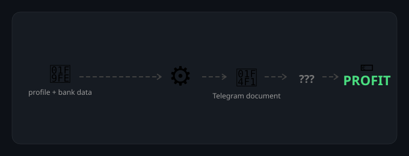

# Finpipe

Finpipe is a Telegram bot that generates salary and bank documents from a saved profile. A requested document is generated as a PDF, sent to the requesting Telegram chat, and removed from the server immediately after the delivery attempt.



## What it does

- Stores company, bank-account, payment, invoice-amount, and signature data.
- Generates a Salary Invoice from the current profile and amount.
- Generates a Conversion Request for the amount extracted from the latest bank document.
- Accepts a bank PDF in Telegram and generates a filled Bank Transfer Confirmation from it.
- Sends the generated PDF directly to Telegram.
- Removes generated PDF and intermediate DOCX files after delivery, including failed delivery attempts.
- Keeps document-generation history and operational audit events in PostgreSQL.

Finpipe does not connect to or send messages through an electronic-mail provider.

## Stack

- Python 3.14 and Poetry
- PostgreSQL, SQLAlchemy, and Alembic
- Telegram Bot API (polling)
- Docker Compose

## Quick start

```bash
poetry install
cp .env.dist .env
# Fill in .env
./scripts/setup_database.sh
poetry run start_bot
```

Required application variables are documented in [.env.dist](.env.dist). At minimum, configure the Telegram bot token, owner identity, signature encryption key, and database URL.

## Telegram flow

1. Open `Profile` and download the YAML template.
2. Fill it in and upload it to the bot.
3. Upload the signature used by signed document workflows.
4. For a Salary Invoice, open `Documents` → `Invoice`, set the amount, and choose `Create invoice`.
5. For a Bank Transfer Confirmation, choose it in `Documents` and upload the source bank PDF.
6. To generate a Conversion Request for the extracted amount, choose it in `Documents` after the bank confirmation completes.

The bot sends every generated PDF to the same Telegram chat and deletes all temporary input, PDF, and intermediate DOCX files.

## Docker

```bash
docker compose up -d

# Local PostgreSQL port exposure
docker compose -f docker-compose.yml -f docker-compose.local.yml up -d
```

## Quality checks

```bash
poetry run ruff check .
poetry run mypy src
poetry run pytest
poetry run alembic check
```

## Documentation

| Topic | File |
|---|---|
| Development and debugging | [docs/development.md](docs/development.md) |
| Storage | [docs/storage.md](docs/storage.md) |
| Monitoring | [docs/monitoring.md](docs/monitoring.md) |
